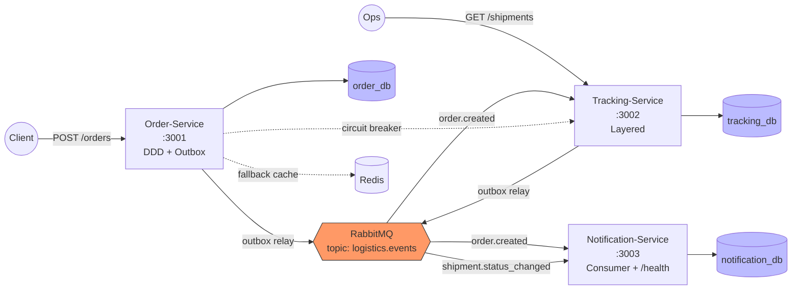

# Real-Time Logistics & Tracking System

[](https://github.com/USER/logistics-platform/actions/workflows/ci.yml)

A senior-level showcase of **event-driven NestJS microservices** demonstrating:

- **Transactional Outbox Pattern** — atomic domain + event writes, no dual-write race
- **DB-first idempotent consumers** — crash-safe deduplication via unique constraints
- **Circuit Breaker** (Opossum) on non-critical read/composition path
- **Dead-Letter Queues** with re-drive CLI
- **OpenTelemetry** distributed tracing + Pino structured logs + Prometheus metrics
- **Database-per-service** isolation (3 logical DBs, one Postgres container)
- **Contract-first events** via Zod schemas shared between producer/consumer
- **DDD + Clean Architecture** in Order-Service

## Architecture



## Tech Stack

| Layer         | Choice                                                          |
| ------------- | --------------------------------------------------------------- |
| Runtime       | Node.js 22+                                                     |
| Framework     | NestJS 10                                                       |
| Language      | TypeScript (strict, no `any`)                                   |
| Database      | PostgreSQL 16 + Prisma                                          |
| Cache         | Redis 7                                                         |
| Broker        | RabbitMQ 3.13 (topic exchange + DLX + delayed-message retry)    |
| Validation    | Zod (events) + class-validator (HTTP DTOs)                      |
| Testing       | Vitest + Testcontainers + supertest                             |
| Observability | Pino + OpenTelemetry + Prometheus                               |
| Monorepo      | pnpm workspaces + Turborepo                                     |
| Infra (dev)   | Docker Compose                                                  |

## Quick Start

```bash
# 1. Install
pnpm install

# 2. Copy env template
cp .env.example .env

# 3. Start infrastructure (Postgres + RabbitMQ + Redis)
pnpm infra:up

# 4. Generate Prisma clients + run migrations
pnpm prisma:generate

# 5. Run all services in dev mode
pnpm dev
```

**Endpoints:**

- Order-Service Swagger: http://localhost:3001/docs
- Tracking-Service Swagger: http://localhost:3002/docs
- RabbitMQ Management: http://localhost:15672 (guest / guest)
- Notification-Service health: http://localhost:3003/health

## Project Structure

```
logistics-platform/
├── apps/
│   ├── order-service/          # DDD + Outbox (showcase)
│   ├── tracking-service/       # Consumer + Publisher
│   └── notification-service/   # Consumer-only + /health
├── libs/
│   ├── contracts/              # Zod event schemas (shared)
│   ├── messaging/              # RMQ client + Outbox + IdempotentConsumer
│   ├── observability/          # Pino + OTel + correlation ID
│   └── testing/                # Testcontainers helpers
├── tools/
│   └── dlq-redrive/            # CLI for DLQ inspection + re-drive
├── docker/
│   ├── postgres/init.sql       # Creates 3 DBs + users
│   └── rabbitmq/definitions.json
└── docker-compose.yml
```

## Commands

| Command                   | Purpose                                     |
| ------------------------- | ------------------------------------------- |
| `pnpm build`              | Build all packages (Turborepo task graph)   |
| `pnpm test`               | Unit + integration tests                    |
| `pnpm test:e2e`           | Full E2E flow via Testcontainers            |
| `pnpm typecheck`          | TypeScript strict typecheck, all packages   |
| `pnpm lint`               | ESLint                                      |
| `pnpm dev`                | Run all services with hot reload            |
| `pnpm infra:up`           | Start Postgres + RabbitMQ + Redis           |
| `pnpm infra:down`         | Tear down + remove volumes                  |
| `pnpm dlq:redrive`        | CLI: re-drive dead-letter messages          |

## Design Documents

See the full TDD with Mermaid diagrams in [docs/ARCHITECTURE.md](./docs/ARCHITECTURE.md) *(to be added in Phase G)*.

## License

MIT
