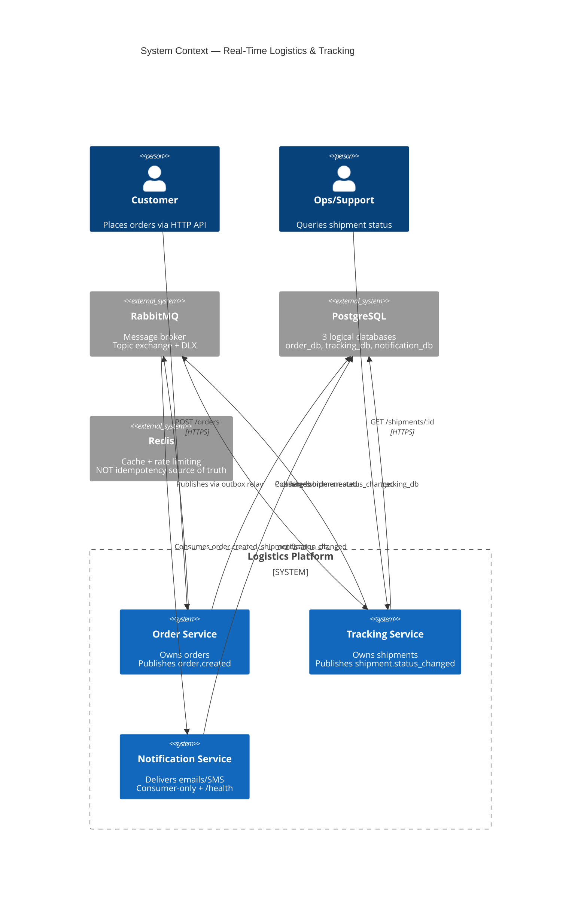
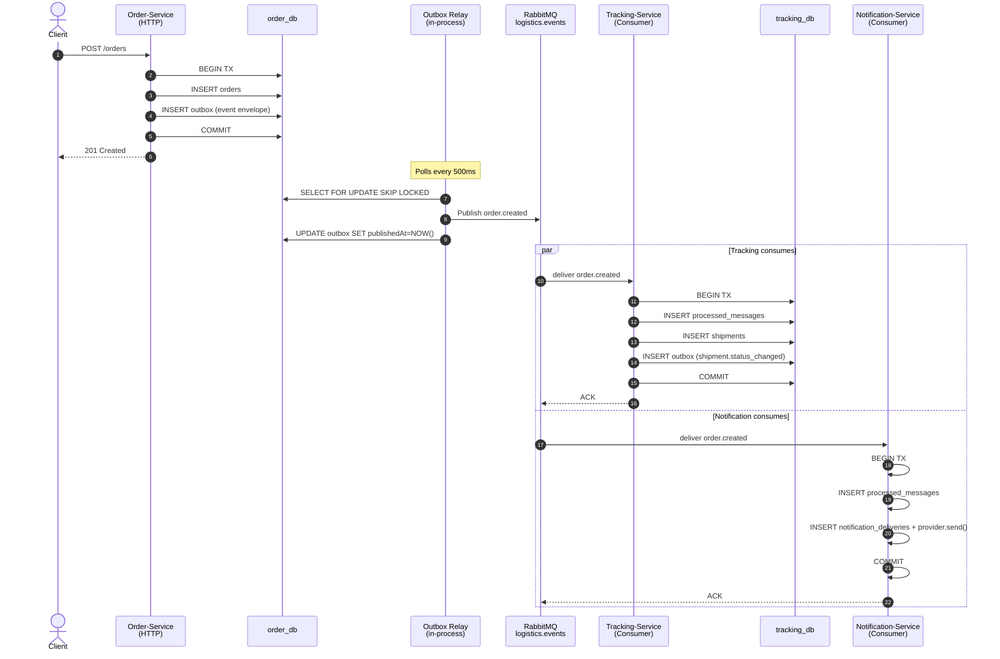
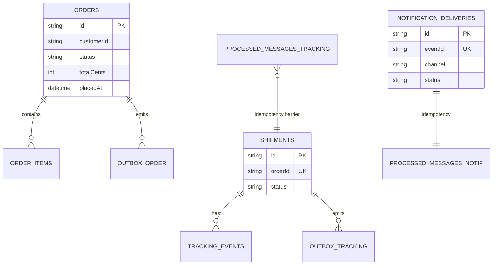

# Architecture — Real-Time Logistics & Tracking System

## 1. System Context



## 2. Service Boundaries

| Service              | Type                   | DB            | HTTP | RMQ Role                                                 |
| -------------------- | ---------------------- | ------------- | ---- | -------------------------------------------------------- |
| Order-Service        | DDD + Outbox           | order_db      | ✅ REST + Swagger | Publisher (order.created, order.cancelled) |
| Tracking-Service     | Layered + Outbox       | tracking_db   | ✅ REST + Swagger | Consumer (order.created) + Publisher (shipment.status_changed) |
| Notification-Service | Consumer-only + layered | notification_db | ⚠️ /health only | Consumer (order.created, shipment.status_changed) |

## 3. Event Flow (Happy Path)



## 4. Resilience

```mermaid
flowchart TB
    subgraph publish["Outbox Relay Publish"]
        P1[Claim batch FOR UPDATE SKIP LOCKED] --> P2{RMQ alive?}
        P2 -->|Yes| P3[Publish with confirm] --> P4[Mark published_at]
        P2 -->|No| P5[Row stays unclaimed<br/>Retry next tick]
        P3 -->|NACK| P6[Increment attempts<br/>Exp backoff]
        P6 -->|attempts > 10| P7[Mark dead_at<br/>Alert + DLQ CLI]
    end

    subgraph consume["Consumer Handler"]
        C1[Receive message] --> C2{Valid envelope?}
        C2 -->|No| C3[Reject to DLQ<br/>requeue=false]
        C2 -->|Yes| C4[BEGIN TX]
        C4 --> C5[INSERT processed_messages]
        C5 -->|Duplicate| C6[Rollback + ACK<br/>Already processed]
        C5 -->|New| C7[Execute side effect]
        C7 -->|Success| C8[COMMIT + ACK]
        C7 -->|Transient error| C9[Rollback + NACK<br/>Requeue w/ backoff]
        C9 -->|retries > N| C10[Route to DLQ]
    end

    subgraph circuit["Circuit Breaker — Read Path Only"]
        CB1[GET /orders/:id/shipment<br/>Order-Service composition endpoint] --> CB2{Opossum state}
        CB2 -->|Closed| CB3[Call Tracking /shipments]
        CB2 -->|Open| CB4[Fallback:<br/>Return cached last-known<br/>from Redis]
        CB2 -->|Half-Open| CB5[Probe single call]
    end
```



## 5. Database-per-Service



## 6. Event Envelope

```typescript
{
  eventId: "uuid-v7",
  eventType: "order.created",
  eventVersion: 1,
  occurredAt: "ISO-8601",
  correlationId: "uuid",
  causationId: "uuid | null",
  producer: "order-service@0.1.0",
  payload: { ... }
}
```

## 7. Observability

| Signal        | Tool                    | Where                                       |
| ------------- | ----------------------- | ------------------------------------------- |
| Logs          | Pino (JSON)             | stdout of each service                      |
| Traces        | OpenTelemetry OTLP      | OTEL_ENABLED=true → Tempo/Jaeger            |
| Metrics       | Prometheus              | `/metrics` (outbox lag, circuit state, DLQ) |
| Correlation   | `x-correlation-id`      | HTTP header + event envelope                |
| Health        | `@nestjs/terminus`      | `/health` (liveness), `/ready` (readiness)  |

## 8. Key Design Decisions

| Decision                          | Rationale                                                         |
| --------------------------------- | ----------------------------------------------------------------- |
| RabbitMQ over Kafka               | Fits workload; showcases tradeoff discipline                      |
| Outbox pattern                    | Prevents dual-write race between DB + broker                      |
| DB-first idempotency              | Crash-safe; Redis `SETNX` has race window                         |
| One Postgres, three logical DBs   | Bounded-context isolation without 3-container infra theater       |
| Circuit Breaker on read path only | Write path is async; sync dep in write = design smell             |
| Zod for events, class-validator for DTOs | Different purposes: cross-service contracts vs HTTP input   |
| Per-service Prisma schema         | Enforces bounded-context DB ownership                             |

## 9. Escalation Triggers

- **Switch to Kafka:** replayable history, partitioned ordering, or >100k msg/s
- **Add Saga pattern:** genuine cross-service business transaction with compensation
- **Split Postgres containers:** infra failure isolation becomes part of demo
- **Add SSE/WebSocket:** real-time push to frontend becomes v2 scope
